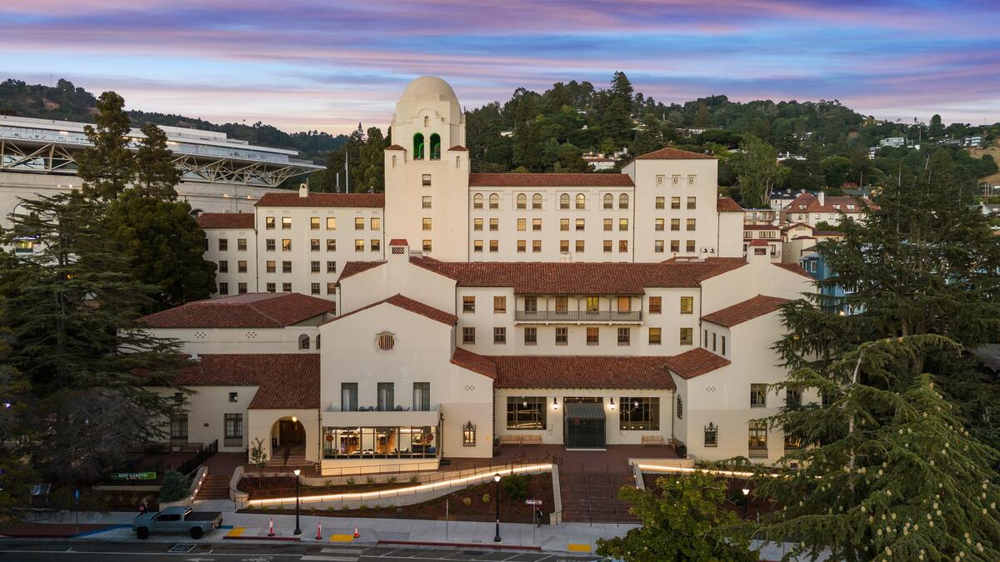

+++
date = "2016-11-05T21:05:33+05:30"
title = "About Me"
+++

Hello! I am a PhD student and NSF Graduate Research Foundation Fellow in the Department of Astronomy & Astrophysics at the University of Chicago. Here, I am working with [Professor Diana Powell](https://astrophysics.uchicago.edu/people/profile/diana-powell/) on sub-Neptune atmospheres, with a particular focus on developing new models for aerosols in the atmospheres of these as-yet enigmatic planets. I also maintain broad and developing interests across planet formation and demographics. 

Before moving to the tropical paradise that is Chicago, I spent some happy years at UC Berkeley, from where I obtained my undergraduate degree in physics & astrophysics in December 2023. I was especially fortunate to get to do research on topics spanning radio astronomy and exoplanet science with amazing mentors including [Sarah Blunt](https://sites.google.com/g.harvard.edu/sarah/home), [Josh Dillon](https://joshdillon.com/), [Konstantin Batygin](https://www.konstantinbatygin.com/), [Brendan Bowler](https://www.physics.ucsb.edu/people/brendan-bowler), [Max Goldberg](https://maxgoldberg.me/), and [Soumavo Ghosh](https://sites.google.com/view/drsoumavoghosh). My time as an undergraduate was considerably enriched by the wonderful community at the UC Berkeley International House, which I was lucky to call home. 

     
